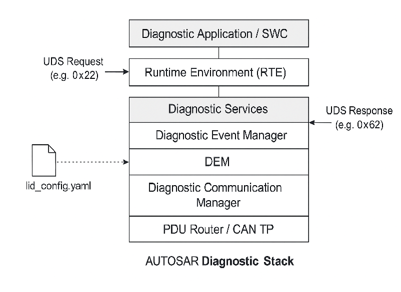

# AUTOSAR Diagnostic Stack 🚗🧰  
A minimal AUTOSAR-inspired diagnostic implementation with UDS service handlers, DTC simulation, and fault memory support.


---

## 📚 Table of Contents
- [Features](#features)
- [Folder Structure](#folder-structure)
- [How to Run](#how-to-run)
- [Architecture](#architecture)
- [Sample UDS Requests](#sample-uds-requests)
- [Contributing](#contributing)
- [LICENSE](LICENSE)

- 
---

## ✅ Features

- Support for key UDS services:
  - Diagnostic Session Control (0x10)
  - ECU Reset (0x11)
  - Clear DTCs (0x14)
  - Read DTC Information (0x19)
  - ReadDataByIdentifier (0x22)
- DTC read/clear operations
- Configurable DIDs
- Fault memory simulation
- Python script for config generation

---

## 📁 Folder Structure

| Folder      | Description                                         |
|-------------|-----------------------------------------------------|
| `src/`      | Source code of the diagnostic manager               |
| `config/`   | Example config files for DIDs and DTCs              |
| `docs/`     | Design documentation and architecture diagrams      |
| `scripts/`  | Automation tools (e.g., DID config generator)       |
| `test/`     | Unit test samples for diagnostic functionality      |

---
# Complex Device Driver Example for MCAL to RTE Communication

This repository demonstrates a simplified example of complex device drivers communicating
between the MCAL (Microcontroller Abstraction Layer) and the RTE (Runtime Environment) in
an AUTOSAR-like architecture.

## Structure

- `mcal/`: Contains CAN driver source and configuration.
- `rte/`: Contains RTE interface for CAN communication.
- `include/`: Common typedefs and definitions.
- `src/main.c`: Example usage and initialization.
- `Makefile`: Build instructions.

## Features

- CAN driver with TX and RX buffer management.
- RTE interface to abstract CAN driver calls.
- Simulated interrupt-driven communication.
- Configurable via `Mcal_Cfg.h`.

## Usage

- Extend drivers to your hardware.
- Integrate with AUTOSAR stack layers.
- Build with `make`.


## 🚀 How to Run

Ensure you have `gcc` installed. Then:

```bash
gcc src/*.c -o diag_test
./diag_test
